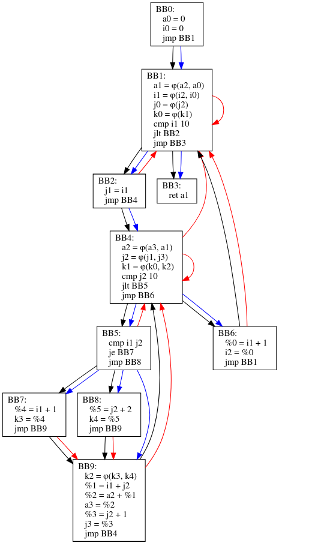

# Построение SSA

Реализовать простейший компилятор (на любом языке):

- простой фронтенд
- реализовать CFG
- на базе CFG реализовать простейший IR
- построить SSA форму над данным представлением

Предусмотреть также вывод графа через GraphVis

## Control Flow Graph

* Черные ребра - ребра самого CFG
* Синие ребра - ребра дерева доминаторов
* Красные ребра - граф фронта доминаторов